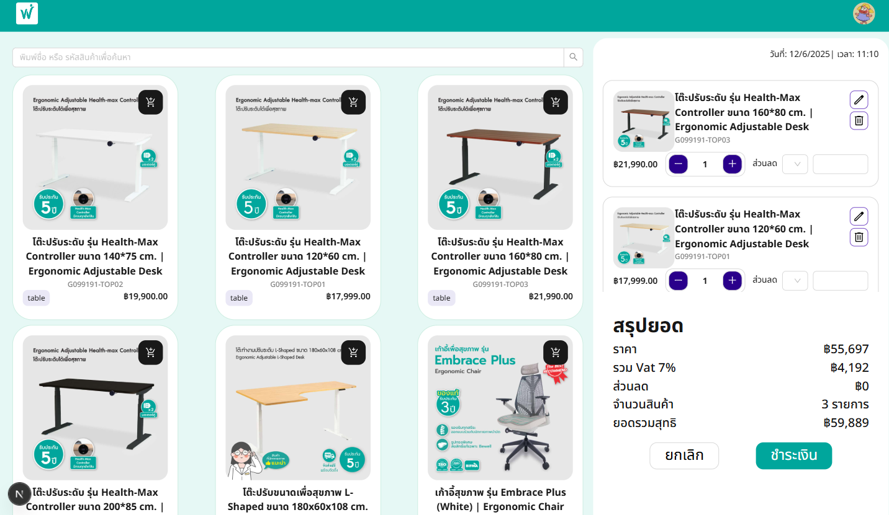
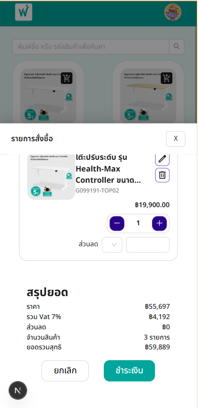

## Getting Started

First, run the development server:

```bash
npm run dev
# or
yarn dev
# or
pnpm dev
# or
bun dev
```

Open [http://localhost:3000](http://localhost:3000) with your browser to see the result.

You can start editing the page by modifying `app/page.js`. The page auto-updates as you edit the file.

This project uses [`next/font`](https://nextjs.org/docs/app/building-your-application/optimizing/fonts) to automatically optimize and load [Geist](https://vercel.com/font), a new font family for Vercel.

## POS

A modern Point of Sale (POS) system built with Next.js. This project provides a responsive interface for managing sales, products, and transactions. It features real-time updates, user authentication, and integration with backend APIs for inventory and order management. Designed for ease of use and scalability, this POS solution is suitable for retail and hospitality businesses looking for a web-based sales platform.

POS display



Mobile display


